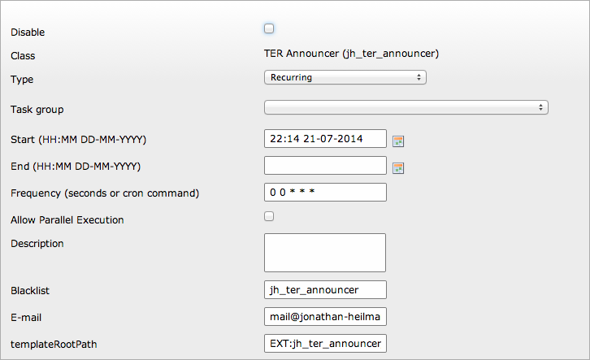

.. ==================================================
.. FOR YOUR INFORMATION
.. --------------------------------------------------
.. -*- coding: utf-8 -*- with BOM.

.. include:: ../Includes.txt

.. _introduction:

Introduction
============

.. _what-it-does:

What does it do?
----------------

If you maintain multiple TYPO3 CMS installations it's hard to keep your eyes on every extension and their updates in TER.
This extensions does some work for you and provides a scheduler task that sends you a mail if an extension-update of a loaded extension is avialable in TER.
For each new extension-version a new mail will be sent. So if you want to skip a version, you won't recieve a mail with this extension listed every time the task is scheduled.

.. _screenshots:

Screenshots
-----------

   The task in scheduler with a sample configuration.

.. _contribute:

Contribute
----------

Feel free to contribute to this extension within TYPO3 Forge: `http://forge.typo3.org/projects/extension-jh_ter_announcer/
<http://forge.typo3.org/projects/extension-jh_ter_announcer/>`_.